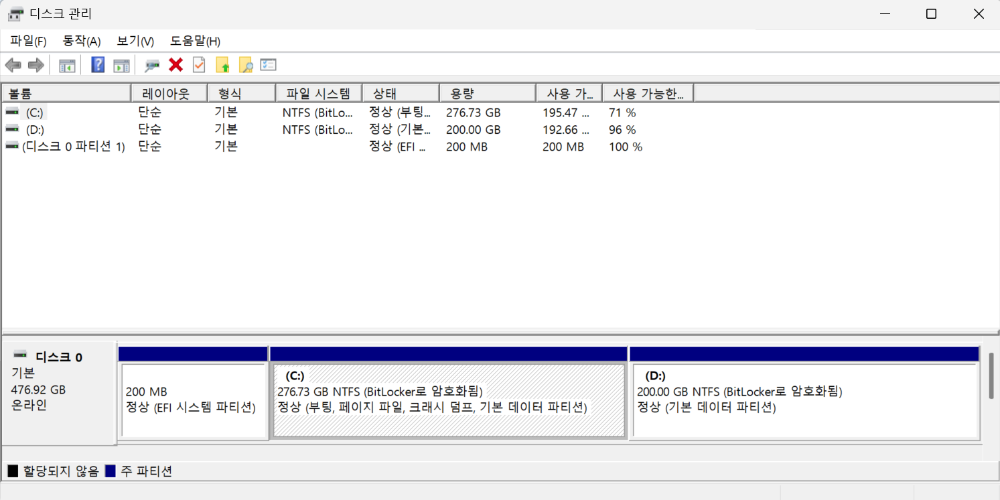

## What is Multi-Booting?
Multi-booting is the process of installing multiple operating systems (OS) on a single computer—such as Windows and Linux—and choosing which one to launch at startup. Each OS is typically installed on a separate partition or physical drive, allowing them to function independently without interference.

## The reason why you don't know the existence of bootloader
Because of Windows and macOS don't offering multi-booting, you might not see the bootloader whether you turn on your computer everyday. In multi-booting system, the bootloader like GRUB or systemd shows at booting your computer. If you are trying to install linux and figure out the problems by yourself, it is highly recommended to understand the booting process.

The firmware called BIOS(Basic Input Ouput System) or UEFI(Unified Extensible Firmware Interface, most modern computer uses EFI but many corporation call their UEFI firmware, BIOS) may be installed to your mainboard. When you press the turn-on button, this program is executed and the firmware find the bootloader program that can load the real operating system. In Windows and macOS, this process doesn't show directly on screen so you cannot recognize the real process of booting operation. 

**BIOS(UEFI) -> Bootloader -> Operating System**

## EFI System Paritition
Every computing system has a EFI system partition to store the bootloader. While the firmware installed to mainboard, the EFI partition is restored on the HD or SSD. 
Inside the Disk Management of Windows, you can see the info of partition about your system.

**Sample Structure**
| EFI System partition | Reserved (Hidden) | C:\ (Windows) | Empty Space |



## How BIOS loads the bootloader
When BIOS is executed, BIOS runs bootloader according to registered priority. If there is no available bootloader, BIOS runs the fallback, "EFI/BOOT/bootx64.efi"
```
EFI (EFI partition)
 ├── BOOT
 │    └── bootx64.efi 
 └── Microsoft
```

When you trying to install new operating system via external media, select the bootloader inside USB.
```
EFI (EFI partition)
 ├── BOOT
 │    └── bootx64.efi 
 ├── USB_NAME
 │    └── boot
 │         └── bootx64.efi
 └── Microsoft
```

After installing linux, default bootloader of linux added to BIOS bootloader list. 
```
EFI (EFI partition)
 ├── BOOT
 │    └── bootx64.efi 
 ├── GRUB
 │    └── grubx64.efi
 └── Microsoft
```

## Bootloader structure inside the Linux
```
/boot
├── vmlinuz-linux         
├── initramfs-linux.img  
├── efi
│ 	 └── EFI
│ 	 	  ├── BOOT
│ 		  │    └── bootx64.efi 
│ 	      ├── GRUB
│ 	      │    └── grubx64.efi
│ 	      └── Microsoft
└── grub
     └── grub.cfg         
```

**vmlinuz-linux** : linux kernel, the core program of linux
**initramfs-linux.img** : initial ram disk, the temporal root file system
**grubx64.efi** : grub bootloader
**bootx64.efi** : default fallback that point to real bootloader, grubx64.efi
**grub.cfg** : grub configuration file

| In Windows             | In Linux | Meaning                    |
| ---------------------- | -------- | -------------------------- |
| EFI System Partition   | sda1     | EFI System Partition       |
| Reserved Space         | sda2     | Windows Reserved Partition |
| C Drive                | sda3     | Windows C:\ Drive          |
| Not Mounted in Windows | sda4     | Linux Root Partition       |
