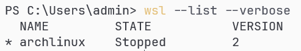

## WSL(Windows Subsystem for Linux)란 무엇인가?
WSL, Windows Subsystem for Linux 는 10버전 이상의 윈도우에엇 사용할 수 있는 리눅스 가상환경이다.  


## WSL로 아치 리눅스 설치하기
윈도우에서 CMD(커맨드 프롬프트) 또는 PowerShell 를 실행한 후 다음 순서대로 입력한다.
```
C:\Users\admin> wsl --install --no-distribution
C:\Users\admin> wsl --list --online              
C:\Users\admin> wsl --install archlinux        
```
- C:\Users\admin 과 같은 경로는 무시하고 wsl 부터 입력한다.

명령어에 대한 옵션을 다음의 경우 축약형으로 사용할 수 있다.
```
--distribution -> -d
--list -> -l
--online -> -o
--verbose -> -v
--terminate -> -t

wsl --list --online           ->  wsl -l -o
wsl --list --verbose          ->  wsl -l -v
wsl --distribution archlinux  ->  wsl -d archlinux
```

다음 명령어를 통해 설치 여부를 확인할 수 있다.
```
C:\Users\admin> wsl --list --verbose 
```


- 목록에 archlinux 항목이 보인다면, 정상적으로 설치된 것이다.

다음 명령어로 WSL 에 설치한 아치 리눅스를 실행한다.
```
C:\Users\admin> wsl --distribution archlinux
```

실행 이후 다음과 같이 명령어 입력 창이 뜬다.
```
[root@wsl admin]# :
```
- [Username]@[Hostname Directory]# 형식으로 나타난다.


## WSL 아치 리눅스 초기 설정
**sudo**
```
[root@wsl admin]# pacman -Syu
[root@wsl admin]# pacman -S sudo nano

[root@wsl admin]# EDITOR=nano visudo
```

열린 문서 내에서 다음 부분을 찾아 수정한다. 
```
수정전
# %wheel ALL=(ALL:ALL) ALL

수정후
%wheel ALL=(ALL:ALL) ALL
```
- Ctrl + x -> y -> Enter 순서로 키를 입력하여 저장 후 종료한다.


**User Account** : WSL에서 아치 리눅스는 기본 사용자 계정이 없는 채로 설치되므로, 명령어를 통해 사용자 계정을 생성할 수 있다.
```
[root@wsl admin]# useradd -m -G wheel -s /bin/bash [username]
[root@wsl admin]# passwd [username]

[root@wsl admin]# nano /etc/wsl.conf
```
- [username] 를 원하는 사용자명으로 대치하여 입력한다.

열린 문서 내에서 다음과 같은 내용을 추가한다.
```
[user]
default=[username]

[network]
hostname=[hostname]
generateHosts=false
```
- [username] 를 원하는 사용자명으로 대치하여 입력한다.
- [hostname] 를 원하는 이름으로 대치하여 입력한다.
- Ctrl + x -> y -> Enter 순서로 키를 입력하여 저장 후 종료한다.


**재부팅**
```
[root@wsl admin]# exit

C:\Users\admin>
```
- WSL 내부 콘솔창에서 exit 를 입력하면 윈도우의 콘솔창으로 돌아온다.


## WSL만의 특징
WSL 는 기본적으로 GUI 가 제공되지 않아 별다른 설정을 하지 않는다면 [root@wsl admin]# 과 같은 콘솔 창에서만 주로 리눅스를 사용할 수 있으며, GUI 를 포함한 전체 데스크톱 리눅스를 체험하려는 경우 직접 설치하거나 가상머신을 이용할 수 있다. 


## 다음 단계
- [8.패키지_관리_방법](./8.패키지_관리_방법.md)