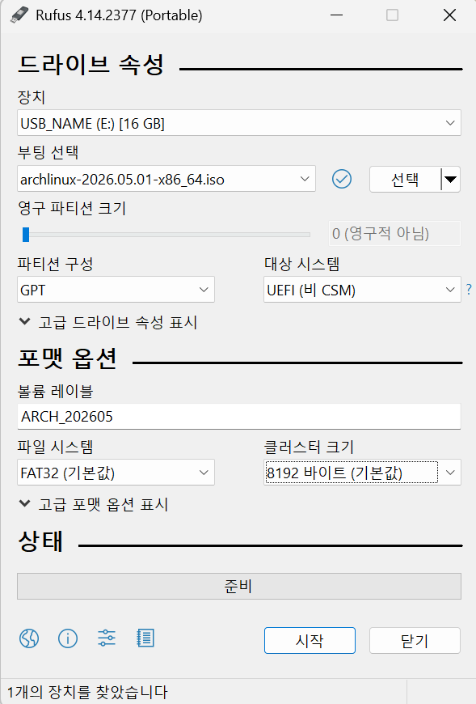

## 준비물
- 8GB 이상의 USB
- 데스크톱의 경우 유선 또는 수신기가 있는 키보드

## 설치 이미지 다운로드
공식 사이트 : https://archlinux.org/download/

설치할 이미지 : **archlinux-[Version]-x86_64.iso**

아치 리눅스를 설치하기 위해서는 설치 이미지를 다운로드 받아야 한다.
공식 사이트에 접속한 후 스크롤을 아래로 내리면 미러 사이트들이 나오는데, 다운로드 하는 위치에 해당하는 국가의 미러 사이트를 사용할 경우 속도가 더 빠를 확률이 높다.

설치할 이미지는 설치할 기기의 종류에 따라 다르지만, 대부분 64bit 시스템이므로 버전에 해당하는 x86_64.iso 이미지를 다운받는다.
macOS 라면, intel 칩셋을 사용하는 경우 x86_64.iso 이미지를, Apple Silicon 프로세서인 경우 ARM 버전을 다운로드 받아야 한다. 아치 리눅스는 ARM 버전의 경우 설치 이미지가 아닌 rootfs 를 제공하므로, 리눅스에 대한 경험이 전무하다면 추천하지 않는다.

## Rufus를 이용한 방법
공식 사이트 : https://rufus.ie/ko/

Download 에서 rufus-[version].exe 또는 rufus-[version]p.exe 를 다운받고 실행한다.

**장치**(Device) : USB 의 이름

**부팅 선택**(Boot selection) : 설치 이미지 파일

**파티션 구성**(Partition scheme) : GPT

**대상 시스템**(Target System) : UEFI

**파일 시스템**(File system) : FAT32

**클러스터 크기**(Cluster size) : 기본값

## Ventoy를 이용한 방법
공식 사이트 : https://www.ventoy.net/en/index.html

## 다음 단계
- [2.설치_이전_설정](./2.설치_이전_설정.md)