## Archinstall이란?
본디 아치 리눅스는 설치가 어려운 리눅스 배포판으로 악명이 자자했다. 수백개의 명령어를 암기해야 하고 시스템에 대한 전문가급 이해도를 필요로 했기에, 초보자에게 추천되지 않는 배포판이었다. 그러나 Archinstall 의 등장 이후 아치 리눅스의 설치는 다른 사용자 친화적 배포판과 유사한 난이도로 내려오게 되었다.
Archinstall 이란 아치 리눅스의 설치 과정에서 입력해야 하는 명령어들을 자동화 하는 프로그램이다. 이 프로그램 덕분에 아치 리눅스를 몇 번의 타이핑만으로 설치할 수 있게 되었다.


## Archinstall 실행
2번 설치 이전 설정에서 네트워크 설정까지 마쳤다면, archinstall 이라고 입력하여 Archinstall 을 실행한다.
Archinstall 이 실행되면, Enter, Escape, Tap 및 방향키를 통해 이동 및 입력할 수 있다.

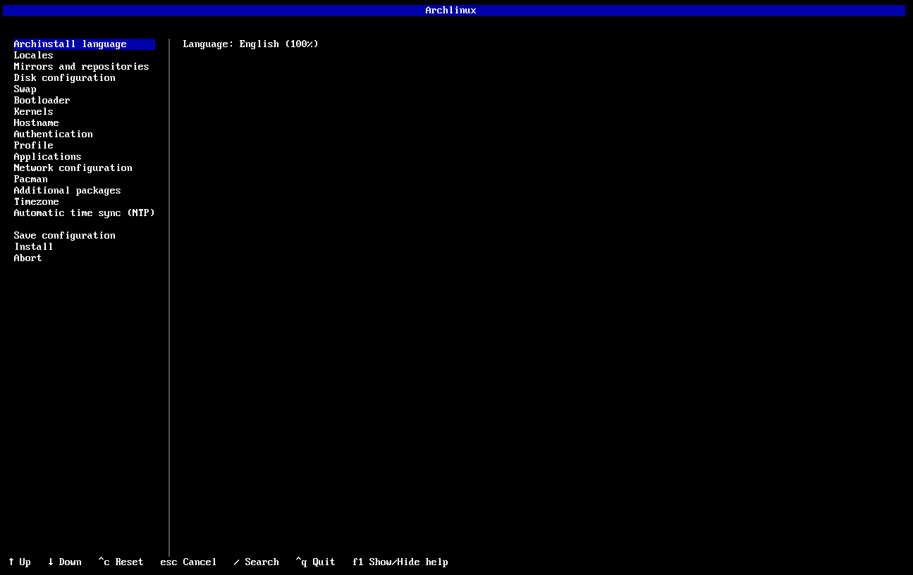


## Archinstall 에서 보이는 항목들
Archinstall 이 실행된 이후, 다음과 같은 항목들이 보인다.
```archinstall
Archinstall language
Locales
Mirrors and repositories
Disk configuration
Swap
Boodloader
Unified kernel images
Hostname
Authentication
Profile
Applications
Kernels
Network configuration
Additional packages
Timezone
```
이 중에서 Disk Configuration 과 Profile 항목은
- [4.파티셔닝](./4.파티셔닝.md)
- [5.데스크톱_종류](./5.데스크톱_종류.md)


에서 향후 서술한다. 다른 설정들을 먼저 마친 이후 확인한다.


## Language and Locales
설치할 아치 리눅스의 시스템 언어를 의미한다. 한국어로 사용이 가능하지만, 몇 가지 이유로 영어 그대로 두는 것을 추천한다.
- 공식 문서가 대부분 영어로 작성되어있다.
- 오류가 발생했을 때, 해당 오류 메시지를 검색해 해결할 때, 영어가 압도적으로 편리하다.


## Mirrors and Repositories
대부분의 리눅스 배포판들은 효율적인 패키지 서버 관리를 위해 미러 사이트를 운영한다. 
단순히 프로그램들을 다운로드 받을 서버라고 생각하면 된다.


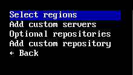
- Select regions 

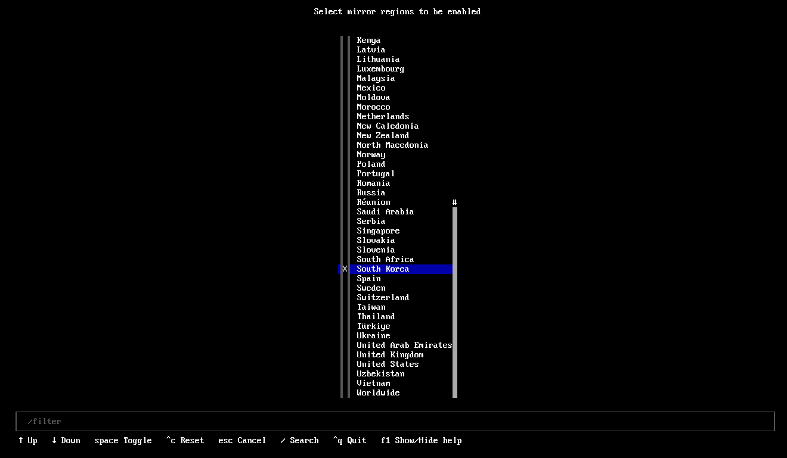
- South Korea 선택


## Swap
가상 메모리 사용 여부를 지정한다. 파티셔닝 단계에서 가상 메모리용 linux swap 파티션을 생성하거나, zram 방식의 가상 메모리를 사용할 수 있다.


## Bootloader
리눅스와 함께 설치할 부트로더의 종류를 지정하는 항목이다. 윈도우 등 다른 운영체제와 멀티부팅 할 때는 GRUB 이 안정적으로 동작하는 경우가 많아 GRUB이 추천된다.


## Hostname
운영체제에서 사용할 기기의 이름을 지정한다. 운영체제가 다른 기기와 소통할 때 대외적으로 사용되는 이름이다. 리눅스 설치를 마치고 부팅하면, 터미널에 다음과 같이 사용자 계정의 이름과 Hostname 이 뜨게 된다.
```bash
Username@Hostname: ~
```


- 원하는 이름을 입력한다.


## Authentication
기본 사용자 계정을 생성하고, 비밀번호를 지정한다.


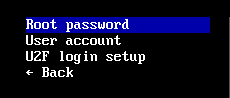
- User account 를 선택한다.

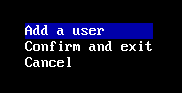
- Add a user 를 선택한다.


- 사용자명을 입력한다.


- 사용자 계정의 비밀번호를 입력한다.

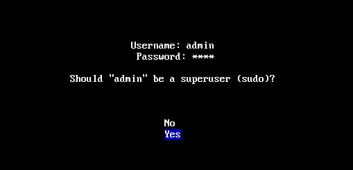
- superuser 로 계정을 생성한다. (Yes)

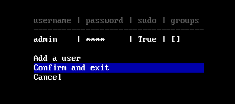


## Applications
블루투스와 프린터 등을 설정한다.


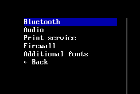
- Bluetooth 선택 이후 Enable

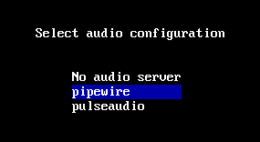
- Audio 에서 pipewire 를 선택한다


## Network configuration
설치 완료 이후 사용할 네트워크 연결 방식을 정한다. 


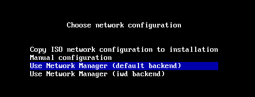
- Use Network Manager (default) 선택


## Additional packages
원하는 패키지들을 추후에 설치할 수 있으므로, 지금은 넘어간다.


## Timezone
시스템의 시간대를 지정하는 항목이다.


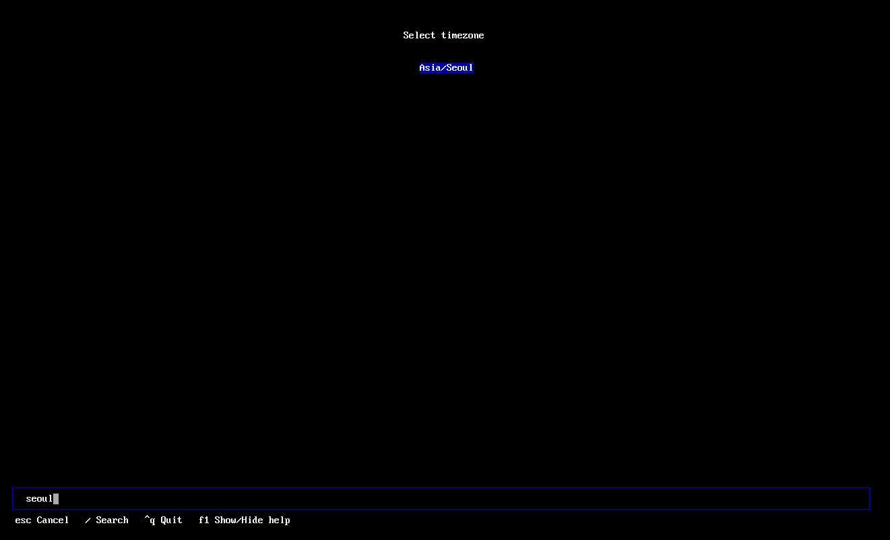
- 슬래시 입력 이후 원하는 지역을 입력하면 빠르게 시간대를 지정할 수 있다.


## Install
다음 장에서 파티셔닝과 GUI 까지 설정을 마친 이후, Install 항목을 눌러 설치를 시작한다.


## 다음 단계
- [4.파티셔닝](./4.파티셔닝.md)