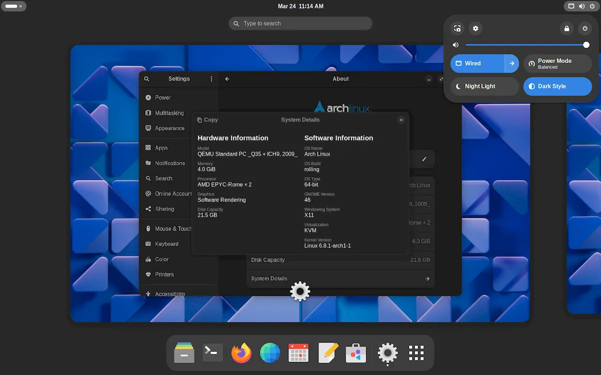
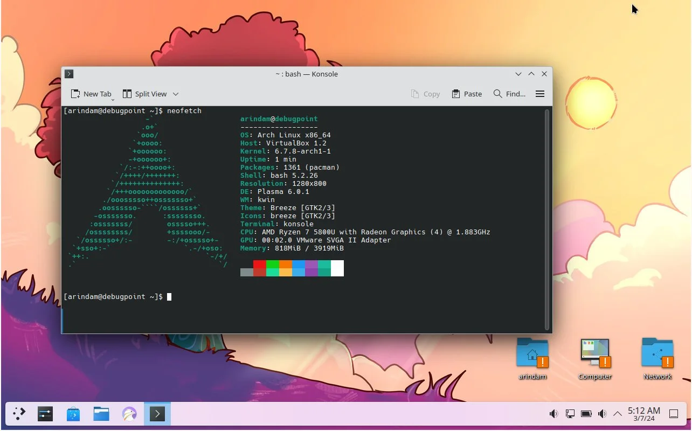
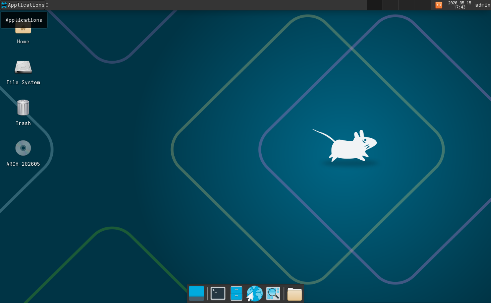
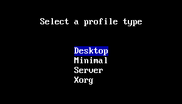
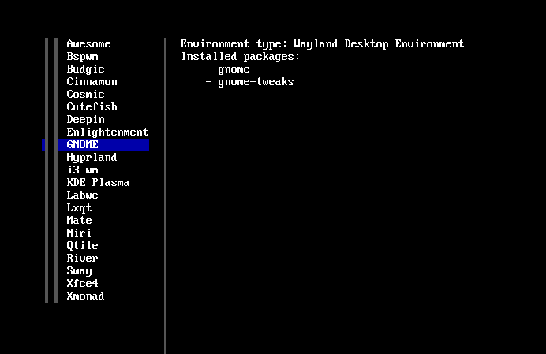

## GUI란?
GUI, Graphical User Interface 란 

## Gnome

## KDE Plasma

## Xfce4

## Hyprland
- 초기 설정 방법이 복잡하다.

## Archinstall 에서 선택하기

- Archinstall 의 Profile 항목에서 Desktop 를 선택한다.
- GUI 없이 CLI 로만 사용한다면, Minimal 또는 Server 를 선택한다.

- 사용하고자 하는 데스크톱 환경을 선택한다.
- 여러 개를 선택할 수 있으나, 저장 용량을 고려하여 선택한다.

## 다음 단계
- [6.부트로더_설정](./6.부트로더_설정.md)