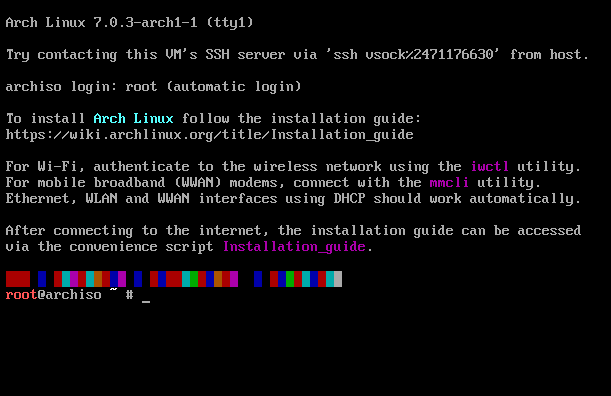
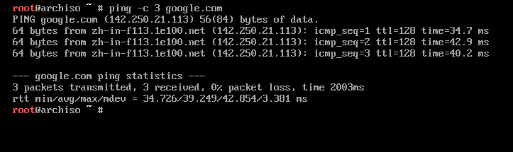

## 펌웨어 설정
**펌웨어 진입**
- 재부팅 시에 제조사의 펌웨어 진입 키를 여러번 눌러 진입한다. 제조사에 따라 F12, F10, F2, Delete 키 등이 사용된다.

**Disable Fast Boot**
- 펌웨어 설정 화면에서 Fast Boot 옵션을 Disable 로 설정해 두어야 설치 미디어를 통해 부팅할 수 있다.

**부팅 우선순위**
- 제작한 설치 미디어의 부팅 우선순위를 맨 위로 두어야 재부팅 이후 설치 미디어로 부팅되게 된다.
- 혹은, 제조사의 Fastboot 옵션 진입 키를 통해 패스트 부트 모드로 들어가 설치 미디어를 선택해도 된다.

**부팅 이후**
- 설치 미디어로 부팅한 이후 
```
root@archiso ~ # 
```




## 네트워크 연결
아치 리눅스 설치 프로그램에서 기본적으로 사용하는 네트워크 관리 패키지는 iwctl 이다. 다음과 같이 명령어를 입력하여 와이파이에 연결한다.
```
root@archiso ~ # iwctl

[iwd]# device list
[iwd]# station wlan0 scan
[iwd]# station wlan0 get-networks
[iwd]# station wlan0 connect [SSID]
[iwd]# exit
```
- [SSID] 는 와이파이 공유기의 이름으로 대치하여 입력한다.


```
root@archiso ~ # ping -c 3 archlinux.org
```
- ping 명령어를 통해 정상적으로 네트워크에 연결됨을 확인한 후 넘어간다.
- 정상적인 연결의 경우 time=20 ms 등과 같이 연결에 걸린 시간을 포함하는 결과가 출력된다.

