## 파티셔닝이란?
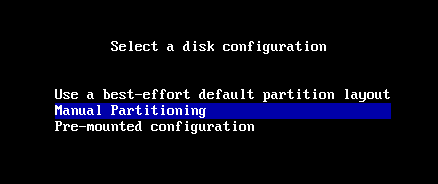
- Archinstall 의 "Disk configuration" 항목에서 Manual Partitioning 선택

## 기본 구성요소
**EFI 파티션** : /boot/efi

**루트 파티션** : /

**Swap 파티션**(선택) : linux swap

**Boot 파티션**(선택) : /boot

| Status | Type    | Start | Length | FS type | Mountpoint | Mount options | Flags |
| ------ | ------- | ----- | ------ | ------- | ---------- | ------------- | ----- |
|        | EFI     |       |        | fat32   | /boot/efi  |               | Boot  |
|        |         |       |        | ntfs    |            |               |       |
|        | primary |       |        | ntfs    |            |               |       |
|        |         |       |        | ext4    | /          |               |       |

## EFI 파티션 생성
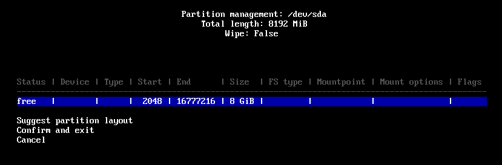
- free space 를 선택한 후 Enter

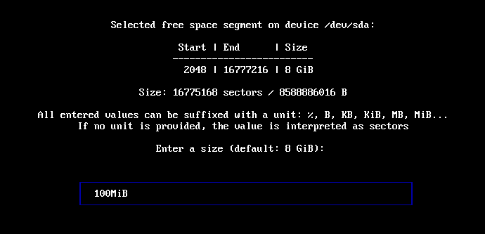
- 100MiB 로 입력한 후 Enter

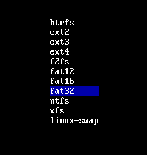
- EFI 시스템 파티션의 포맷 형식은 fat32 로 한다.

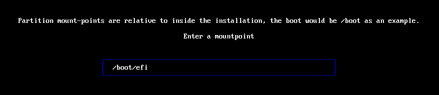
- 마운트 포인트는 /boot/efi 로 지정한다.

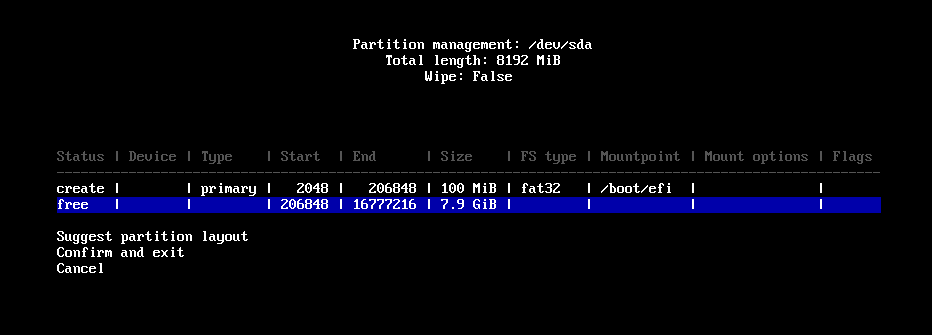
- EFI 파티션 생성 모습

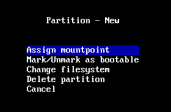
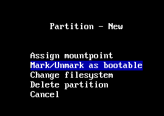
- 만들어진 EFI 파티션을 선택하고 Enter 를 눌러 bootable 마크를 지정한다.

## 루트 파티션 생성
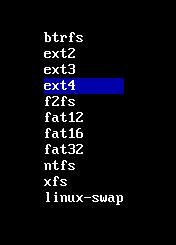
- EFI 파티션과 동일하게 free space 를 선택한 후 빈 모든 공간을 사용하기 위해 크기 입력 화면에서 Enter 를 누른다
- 리눅스의 루트 파티션의 포맷 형식은 대체로 ext4 형식을 사용한다.
- 마운트 포인트는 / 로 한다.

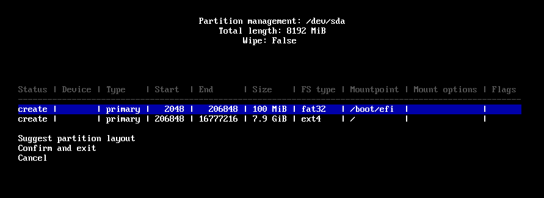
- 루트 파티션 생성 모습

## Confirm
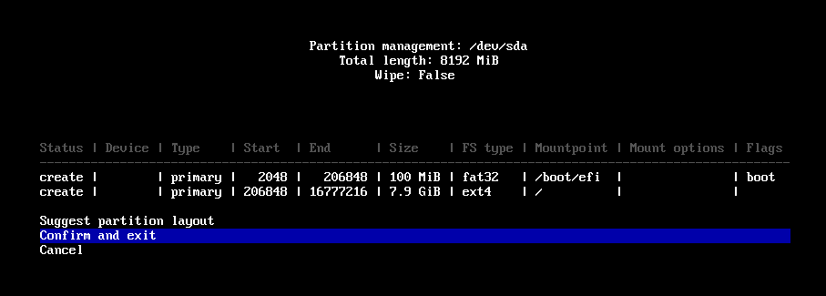
- 최종 점검 후 Confirm. 
