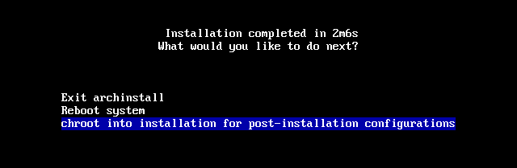
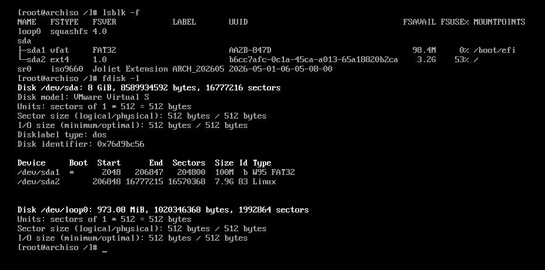
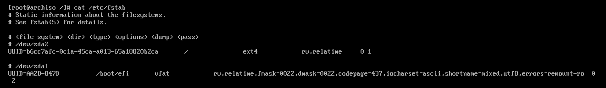
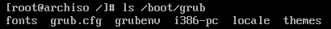
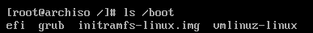

## Chroot
설치를 마친 이후, 다음과 같은 몇 가지의 선택지가 나온다.
- **Exit archinstall**
- **Reboot system**
- **Chroot into installation**



- Chroot 옵션을 선택하여 정상적으로 설치되었는지 확인한다.


**파티션 구조 확인**
- Chroot 이후, 다음 명령어를 입력하여 파티셔닝 단계에서 의도한대로 파티션이 생성되었는지 확인한다.
```
lsblk -f
fdisk -l
```



**부트로더 존재 확인**
- 명령어를 입력할 때 다음과 같은 결과가 출력되는지 확인한다.
```
cat /etc/fstab 
-> / /boot/efi

ls /boot/efi/EFI
-> BOOT GRUB

ls /boot 
-> vmlinuz-linux initramfs-linux.img 

ls /boot/grub/
-> grub.cfg

ls /boot/efi/EFI/GRUB 
-> grubx64.efi
```
- 해당 결과가 나온다면 정상적으로 설치되었으며, reboot 입력 후 재부팅한다. 
- 위 파일들이 없다면 아래 명령어들로 부트로더를 다시 설치할 수 있다.



- 파티셔닝 단계에서 생성한 마운트 포인트가 존재하는지 확인한다. (/, /boot/efi)






## 부트로더 재설치
**GRUB 재설치**
```
grub-install --target=x86_64-efi --efi-directory=/boot/efi --bootloader-id=GRUB --boot-directory=/boot --recheck

grub-mkconfig -o /boot/grub/grub.cfg
```

**부트로더 리스트 추가**
```
efibootmgr --create --disk /dev/sda --part 1 --label "Arch Linux" --loader /EFI/GRUB/grubx64.efi
```


## 부트로더에서 윈도우 선택 항목이 보이지 않는 경우
윈도우와 멀티부팅인데 부트로더에서 윈도우 선택 항목이 보이지 않는 경우, 리눅스로 부팅한 이후 다음과 같은 명령어를 실행하여 부트로더에서 윈도우 선택 옵션을 만들 수 있다.
```
sudo pacman -S os-prober
sudo vim /etc/default/grub
```

파일에서 GRUB_DISABLE_OS_PROBER 항목을 찾아 다음과 같이 수정한다.
```
GRUB_DISABLE_OS_PROBER=false
```

grub-mkconfig 명령어를 통해 grub 설정 파일을 수정한다.
```
grub-mkconfig -o /boot/grub/grub.cfg
```

